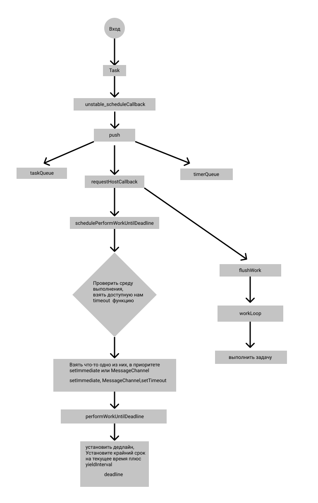

# Модуль планирования из реакт с пояснениями к коду

Проект следует перевести в react 18.
И сделать красивенькое оформление схемы, написать про механизм, как реакт взаимодействует с этим планировщиком посредством Lane и Lanes

Это система планирования, используемая внутри React, а основная функция входа - unstable_scheduleCallback. Ниже приведена блок-схема, подробное объяснение можно увидеть в коде.

